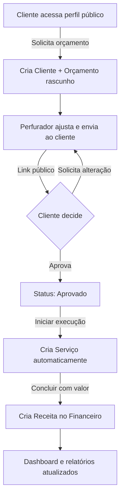
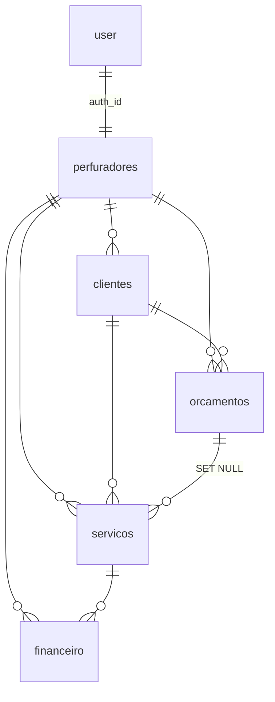

# Nexa Drill — Relatório do Sistema

> **Gestão para Perfuradores de Poços**
> Documento gerado a partir da análise do código-fonte. Cobre o que o sistema faz (capacidades de negócio), como funciona (arquitetura técnica) e seus principais pontos fortes.

---

## 1. Resumo executivo

O **Nexa Drill** é uma plataforma **SaaS multi-inquilino** de gestão feita sob medida para **perfuradores de poços artesianos** no Brasil (toda a interface é em pt-BR). Cada conta representa um **perfurador** — o profissional ou a empresa de perfuração — que passa a ter, num único lugar, a operação completa do seu negócio: captação de clientes, orçamentos, execução técnica dos poços, controle financeiro e uma vitrine pública para atrair novos clientes.

Diferente de um ERP genérico, o sistema entende o domínio: captura dados técnicos reais de um poço (profundidade, vazão, níveis estático e dinâmico, tipo de solo, diâmetro) e conecta todo o ciclo comercial — **do primeiro contato do cliente até o registro da receita** — em um fluxo automatizado.

---

## 2. O que o sistema faz (capacidades de negócio)

### 2.1 Autenticação sem senha
Login e cadastro por **código OTP enviado por e-mail** (6 dígitos, validade de 10 min) — sem senha para lembrar. O fluxo tem 2 passos: informar o e-mail → digitar o código. Ao criar a conta, o perfil do perfurador é gerado automaticamente com um `slug` único para o perfil público.
*Arquivos: [src/lib/auth.ts](../src/lib/auth.ts), [src/app/(auth)/login/page.tsx](../src/app/(auth)/login/page.tsx)*

### 2.2 Dashboard (visão geral)
Tela inicial com saudação dinâmica por horário e um panorama do negócio:
- **4 KPIs** com comparação percentual vs. mês anterior: total de clientes, orçamentos ativos, serviços do mês e faturamento do mês.
- **Gráfico Receita × Despesa** dos últimos 6 meses.
- Lista dos **5 orçamentos mais recentes** com status e valor.
- Bloco **"Próximas Ações"**: orçamentos aguardando aprovação, serviços em andamento e atalho para criar orçamento.

Os dados são agregados no servidor em uma única chamada com ~12 consultas em paralelo.
*Arquivos: [src/app/dashboard/page.tsx](../src/app/dashboard/page.tsx), [src/app/dashboard/actions.ts](../src/app/dashboard/actions.ts)*

### 2.3 Clientes
Gestão completa da carteira de clientes:
- **Criar, editar e excluir** (com diálogo de confirmação).
- **Busca** por nome/telefone (com debounce) e **paginação** (10 por página, no servidor).
- **Página de detalhe** com cartões de contato (telefone e e-mail clicáveis), histórico de orçamentos e serviços, **total recebido** e um **"score de qualidade"** calculado (Novo / Excelente / Bom / Regular / Atenção) a partir da taxa de sucesso dos serviços.
- **Contato direto por WhatsApp** (link `wa.me`).
- Interface responsiva: tabela no desktop, cards no celular.

*Arquivos: [src/app/dashboard/clientes/](../src/app/dashboard/clientes/), [src/components/clientes/](../src/components/clientes/)*

### 2.4 Orçamentos + Kanban
O coração comercial do sistema.
- **Board Kanban arrastar-e-soltar**: colunas por status — Rascunho → Enviado → Aprovado → Em Execução → Concluído. Arrastar um card **muda o status** do orçamento (com atualização otimista).
- **Formulário inteligente**: seleção de cliente (com opção de **criar cliente na hora**), dados técnicos (tipo de serviço, profundidade estimada, diâmetro, tipo de solo) e **itens dinâmicos** com "quick chips" pré-definidos (perfuração por metro, tubo de revestimento, bomba submersa, filtro, cimentação, etc.).
- **Cálculo em tempo real** de subtotal, desconto e valor final.
- **Dois modos de salvar**: "Salvar como Rascunho" ou "Salvar e Enviar ao Cliente".
- **Ações contextuais por status** na tela de detalhe: enviar ao cliente, copiar/compartilhar link, iniciar execução, concluir e baixar PDF.
- **Compartilhamento por WhatsApp** com mensagem pré-formatada (valor + link).

*Arquivos: [src/app/dashboard/orcamentos/](../src/app/dashboard/orcamentos/), [src/components/kanban/](../src/components/kanban/), [src/components/orcamento/orcamento-form.tsx](../src/components/orcamento/orcamento-form.tsx)*

### 2.5 Serviços (execução técnica)
Registro técnico da perfuração executada — o que diferencia o Nexa Drill de um sistema genérico:
- Campos técnicos do poço: **profundidade real, diâmetro, tipo de solo encontrado, vazão (L/h), nível estático e nível dinâmico**, endereço e datas.
- **Upload de fotos** (até 5 MB cada) que alimentam o **portfólio público**.
- Listagem com cards-resumo (total, em andamento, concluídos, cancelados), busca e filtro por status.
- **Conclusão com receita**: ao concluir um serviço, registra-se o valor recebido e um **lançamento de receita é criado automaticamente** no financeiro.

*Arquivos: [src/app/dashboard/servicos/](../src/app/dashboard/servicos/), [src/components/servicos/servico-form.tsx](../src/components/servicos/servico-form.tsx)*

### 2.6 Financeiro
Livro-caixa completo do negócio:
- **Adicionar receita / despesa**, editar e excluir lançamentos, por categoria (combustível, material, equipamento, funcionário, serviço, etc.).
- **Filtro por período**: mês atual, 3 meses, 6 meses, ano ou todo o período.
- 4 indicadores: Receita Total, Despesas Total, **Lucro Líquido** e **Ticket Médio**.
- **Gráfico de barras** (receita × despesa por mês) e **gráfico de pizza** (despesas por categoria).
- Tabela de lançamentos com paginação (15 por página).
- **Integração automática**: receitas de serviços/orçamentos concluídos entram sozinhas.

*Arquivos: [src/app/dashboard/financeiro/](../src/app/dashboard/financeiro/), [src/components/financeiro/](../src/components/financeiro/)*

### 2.7 Perfil da empresa
Configuração da identidade do perfurador:
- Dados básicos (nome, empresa, telefone/WhatsApp, cidade, estado).
- **Upload de logo** (até 2 MB).
- Bio (até 500 caracteres), raio de atendimento, profundidade máxima, **tipos de serviço** e **tipos de solo com experiência** (seleção por chips).
- **Slug personalizado** para a URL do perfil público.

*Arquivos: [src/app/dashboard/perfil/](../src/app/dashboard/perfil/)*

### 2.8 Páginas públicas (sem login)
Duas vitrines que transformam o sistema em ferramenta de aquisição de clientes:

**Perfil público** (`/perfil/[slug]`) — uma landing page de marketing por perfurador, com **SEO** (Open Graph + JSON-LD `LocalBusiness` para o Google), hero com avaliação e estatísticas, especialidades, **portfólio** dos últimos serviços concluídos (com foto, profundidade e vazão), botões de WhatsApp e compartilhamento, e um **formulário de solicitação de orçamento** que cria automaticamente um cliente + orçamento em rascunho para o perfurador.

**Orçamento público** (`/orcamento/[id]`) — link compartilhável (via token UUID) onde o cliente vê o orçamento completo, detecta validade/expiração e pode **aprovar** ou **solicitar alteração** — tudo sem precisar de conta. Também permite baixar o PDF.

*Arquivos: [src/app/perfil/[slug]/](../src/app/perfil/), [src/app/orcamento/[id]/](../src/app/orcamento/)*

---

## 3. Como funciona (arquitetura e fluxo)

### 3.1 Fluxo automatizado ponta a ponta
O maior diferencial técnico é a **integração automática entre os módulos**: um dado inserido em uma ponta se propaga sozinho até o financeiro, eliminando retrabalho.

### 3.2 Stack técnica
| Camada | Tecnologia |
|---|---|
| Framework | Next.js 14 (App Router) + React 18 |
| Linguagem | TypeScript (modo `strict`) |
| Estilo | Tailwind CSS + design system próprio |
| Banco de dados | PostgreSQL (Supabase) |
| Armazenamento | Supabase Storage (buckets `perfis` e `servicos`) |
| Autenticação | better-auth (plugin email OTP) |
| E-mail | Nodemailer (SMTP) |
| PDF | @react-pdf/renderer |
| Gráficos | recharts |
| Kanban / drag-and-drop | @hello-pangea/dnd |
| Formulários / validação | react-hook-form + zod |
| Notificações | sonner (toasts) |

### 3.3 Arquitetura de dados
- O acesso a dados é feito via **Server Actions** (`"use server"`) — não há uma API REST pública além do handler de autenticação.
- Um helper central, `getAuthenticatedPerfurador()` ([src/lib/get-perfurador.ts](../src/lib/get-perfurador.ts)), valida a sessão e resolve o perfurador logado; é reutilizado por praticamente todas as actions.
- **Multi-tenancy single-database**: cada tenant é um `perfurador`, e o isolamento se dá filtrando toda consulta por `perfurador_id`.
- O acesso ao banco usa o **service-role client** do Supabase ([src/lib/supabase/service.ts](../src/lib/supabase/service.ts)).

### 3.4 Modelo de dados
Cinco tabelas de domínio + as tabelas do better-auth.

- **`perfuradores`** — perfil da empresa/profissional (entidade central e raiz do multi-tenancy): dados, logo, bio, especialidades, `slug` público.
- **`clientes`** — carteira de clientes de cada perfurador.
- **`orcamentos`** — propostas comerciais (itens em JSONB, máquina de status, `link_publico` UUID).
- **`servicos`** — execução técnica do poço (profundidade, vazão, níveis, fotos, materiais).
- **`financeiro`** — lançamentos de receita/despesa (opcionalmente vinculados a um serviço).

*Definições em [supabase/migrations/](../supabase/migrations/) e tipos em [src/types/index.ts](../src/types/index.ts).*

### 3.5 Interface e experiência
- **Componentes de UI próprios** (estilo shadcn, mas sem Radix), com design system temático de "água/perfuração" (paleta azul, ícone `Droplets`).
- **Totalmente responsivo**: sidebar no desktop e menu-drawer no mobile — pensado para uso em campo pelo celular.
- Skeletons de carregamento, toasts e diálogos de confirmação em todo o app.
- Constantes de navegação, status e categorias centralizadas em [src/lib/constants.ts](../src/lib/constants.ts).

### 3.6 Geração de PDF
Os orçamentos geram um **PDF profissional em A4** ([src/components/orcamento/orcamento-pdf.tsx](../src/components/orcamento/orcamento-pdf.tsx)): banner com logo e dados da empresa, faixa de status colorida, tabela de itens, totais, condições, observações, **linhas de assinatura** (contratado/contratante) e rodapé numerado.

---

## 4. Principais pontos fortes

1. **Vertical de nicho, não genérico.** Captura dados técnicos reais de perfuração (vazão, níveis estático/dinâmico, tipo de solo, diâmetro) que nenhum ERP genérico oferece — falando a língua do perfurador.

2. **Fluxo integrado e automatizado.** Orçamento → serviço → receita se conectam sozinhos. Aprovar um orçamento cria o serviço; concluir o serviço lança a receita. Menos digitação, menos erro, menos retrabalho.

3. **Aquisição de clientes embutida.** O perfil público com SEO/JSON-LD e o formulário de solicitação transformam o sistema em canal de captação de leads — o lead vira cliente + orçamento automaticamente.

4. **Experiência de venda profissional.** PDF com assinaturas, link público para o cliente aprovar sem login e compartilhamento por WhatsApp elevam a percepção de profissionalismo.

5. **Baixa fricção de acesso.** Login sem senha (OTP por e-mail) reduz barreira de entrada e elimina o problema de senhas esquecidas.

6. **Feito para o campo.** Interface responsiva e gratuita, pensada para uso no celular durante a execução dos serviços.

---

## 5. Pontos de atenção / evolução

Observações técnicas honestas para o roadmap:

- **RLS desabilitada.** O Row Level Security do Postgres está desligado em todas as tabelas de domínio; o isolamento entre perfuradores é feito **100% na aplicação** (filtros por `perfurador_id` usando a service-role key). É o principal risco arquitetural — qualquer filtro esquecido em uma action expõe dados de outro tenant. Recomenda-se testes automatizados cobrindo o isolamento.
- **`README.md` desatualizado.** É o template padrão do `create-next-app`, sem informação do projeto. (Este relatório ajuda a suprir a lacuna de documentação.)
- **Migrations sem controle de versão.** O script aplica todos os arquivos em ordem, sem tabela de tracking, e há **colisão de prefixo `004`** (dois arquivos). A idempotência depende dos `IF NOT EXISTS`.
- **Código legado de Supabase Auth.** Restam arquivos da arquitetura anterior (ex.: [src/lib/supabase/middleware.ts](../src/lib/supabase/middleware.ts)) que já não fazem parte do fluxo de autenticação atual (better-auth).
- **Escrita pública sem rate-limiting.** A action `enviarSolicitacaoOrcamento` (formulário público) insere cliente + orçamento sem limitação de taxa aparente — vale adicionar proteção contra abuso/spam.

---

*Relatório baseado na análise do código em `/home/souagro/Documents/nexadrill/nexa-drillApp` (branch `main`).*
